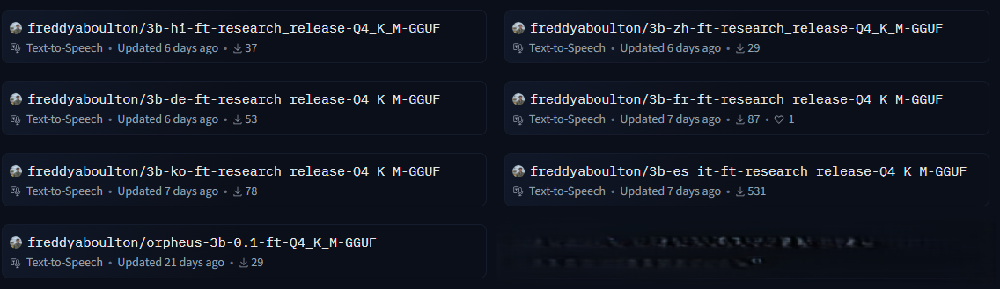

# ComfyUI-Orpheus Node

2 custom nodes for ComfyUI that enables text-to-speech generation using the GGUF [Orpheus](https://github.com/canopyai/Orpheus-TTS) model with emotional speech capabilities.


## Features

- High-quality text-to-speech synthesis
- Multiple voice options (24 different voices, depend language used) in **English, French, Spanish, Italian, Chinese, Korean, German, Hindi**
- Emotional speech capabilities
- Seamless integration with ComfyUI workflow

## Available Voices

- **English Voices**:

  supported tags : chuckle, cough, gasp, groan, laugh, sigh, sniffle, yawn

  - `tara` - Female voice
  - `leah` - Female voice
  - `jess` - Female voice
  - `leo` - Male voice
  - `dan` - Male voice
  - `mia` - Female voice
  - `zac` - Male voice
  - `zoe` - Female voice

- **French Voices**:

  supported tags : chuckle, cough, gasp, groan, laugh, sigh, sniffle, whimper, yawn

  - `pierre` - Male voice
  - `amelie` - Female voice
  - `marie` - Female voice (doesn't works well)

- **German Voices**:

  supported tags : chuckle, cough, gasp, groan, laugh, sigh, sniffle, yawn

  - `jana` - Female voice
  - `thomas` - Male voice
  - `max` - Male voice

- **Korean Voices**:

  supported tags : 한숨, 헐, 헛기침, 훌쩍, 하품, 낄낄, 신음, 작은 웃음, 기침, 으르렁

  - `유나` - ?^^
  - `준서` - ?^^

- **Chinese Voices**:

  supported tags : 嬉笑, 轻笑, 呻吟, 大笑, 咳嗽, 抽鼻子, 咳

  - `长乐` - ?^^
  - `白芷` - ?^^

- **Hindi**:

  supported tags : unknow

  - `ऋतिका` - ? ^^

- **Spanish Voices**:

  supported tags : groan, chuckle, gasp, resoplido, laugh, yawn, cough

  - `javi` - Male voice
  - `sergio` - Male voice
  - `maria` - Female voice

- **Italian Voices**:

  supported tags : sigh, laugh, cough, sniffle, groan, yawn, gemito, gasp

  - `pietro` - Male voice
  - `giulia` - Female voice
  - `carlo` - Male voice

## Requirements

- Last ComfyUI version with python 3.12.9 (may be works with older versions but I haven't test it)

## Installation

1. Clone this repository into your ComfyUI custom nodes directory:

```bash
cd ComfyUI/custom_nodes
git clone https://github.com/your-repo/ComfyUI-Orpheus.git
```

2. Install the required dependencies:

load venv and :

```bash
pip install -r ComfyUI-Orpheus/requirements.txt
```

use python_embeded :

```bash
python_embeded\python.exe -m pip install -r ComfyUI-Orpheus/requirements.txt
```

3. Download the required [GGUF model](https://huggingface.co/freddyaboulton) from [FreddyAboulton](https://huggingface.co/freddyaboulton) huggingface page, and place it in your ComfyUI models directory under `models/unet/`.

   

4. **GPU Support**

On windows, default installation of llama-cpp-python doesn't take GPU support. If you want GPU Support you need
to locate `nvcc.exe` folder and:

```bash
set CMAKE_ARGS="-DGGML_CUDA=on"
set CUDA_CXX="YOUR_CUDA_DIR\v12.6.3\bin\nvcc.exe"
python_embeded\python.exe -m pip install llama-cpp-python[server] --upgrade --force-reinstall --no-cache-dir
```

Be patient, it takes time...

## Usage

1. In ComfyUI, locate the "Orpheus ⛓️" node in the node menu.

2. Configure the node parameters:

   - `model_name`: Select your GGUF model
   - `voice`: Choose from available voices
   - `prompt`: Enter the text you want to convert to speech, you can add emotive tags :\<laugh>, \<chuckle>, \<sigh>, \<cough>, \<sniffle>, \<groan>, \<yawn>, \<gasp>

3. Connect the node outputs:
   - `audio`: Contains the generated audio waveform and sample rate

## Limitations

- Maximum text length determined by MAX_TOKENS
- Processing speed depends on GPU capabilities
- Requires CUDA support for optimal performance

## Credits

- Original [Orpheus](https://github.com/canopyai/Orpheus-TTS) implementation
- [Freddy Aboulton](https://huggingface.co/freddyaboulton)
